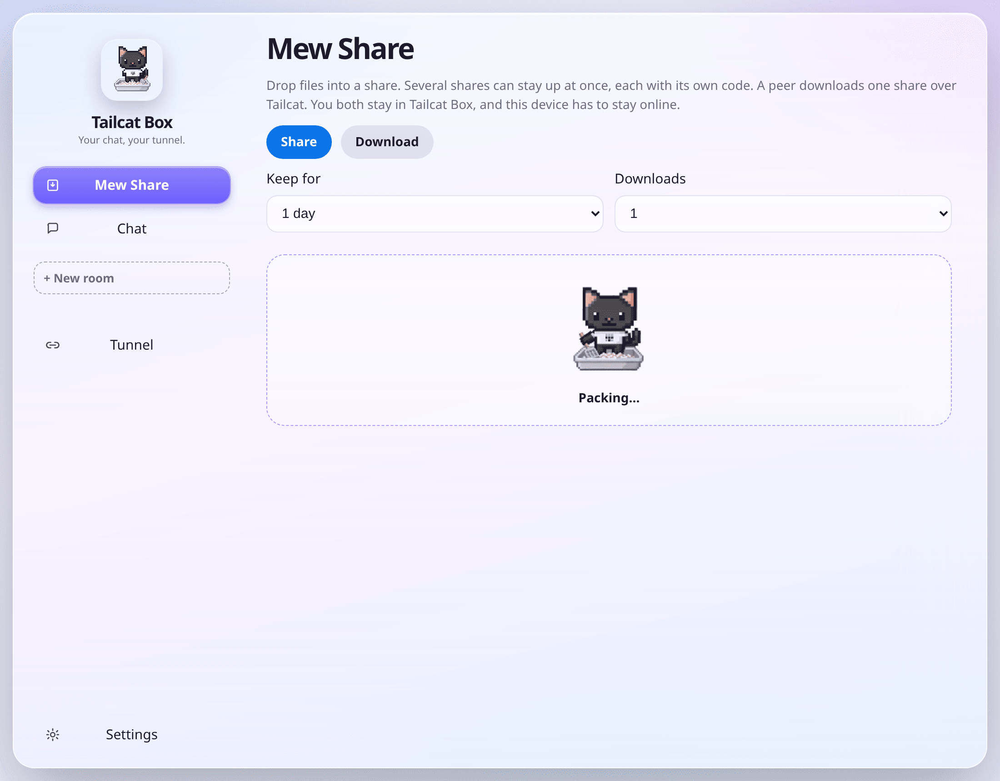
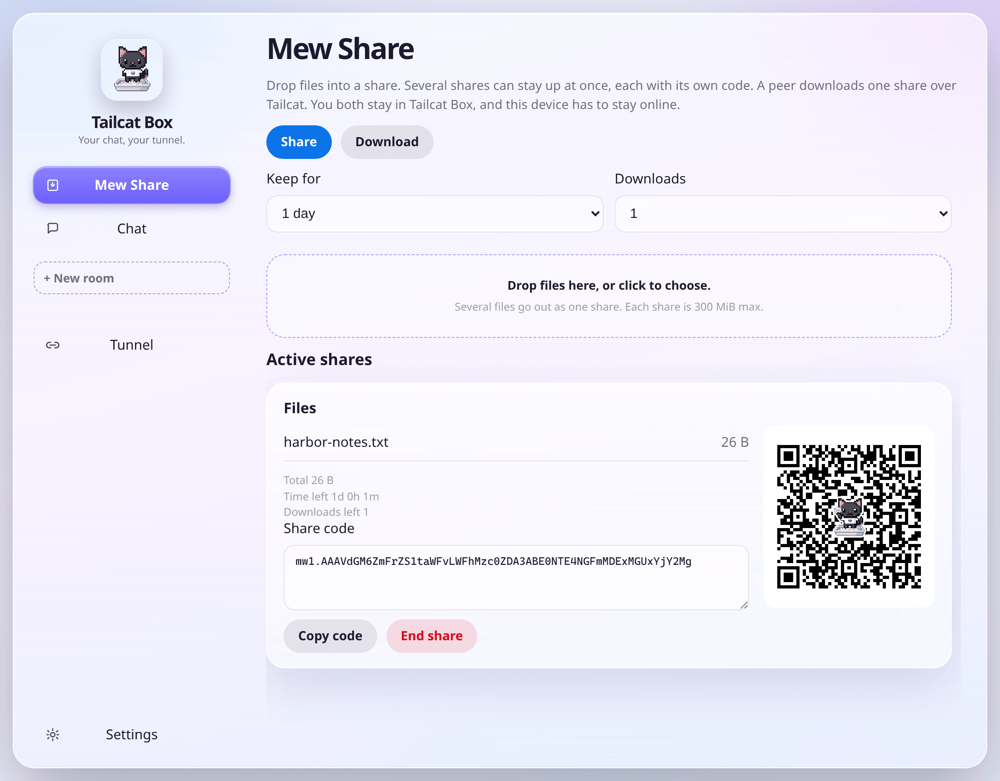
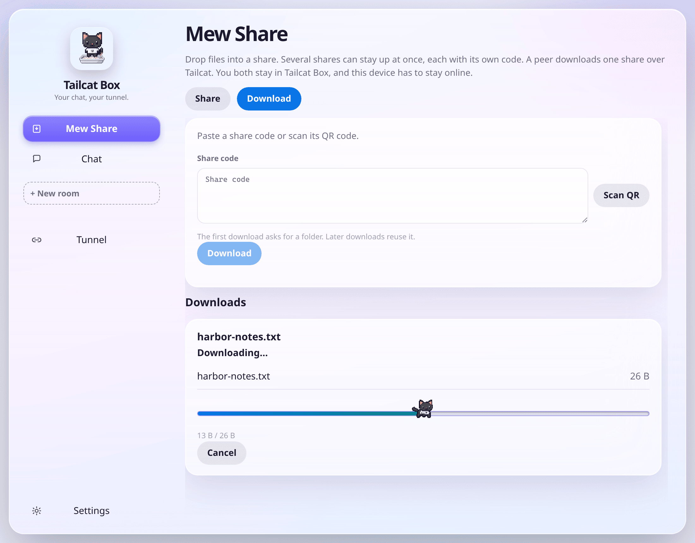
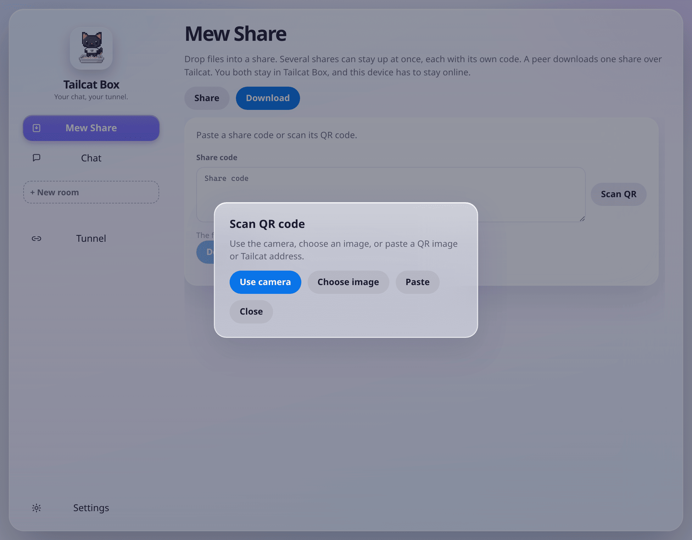

# Tailcat Box 

[中文说明](README.zh-CN.md)

Desktop GUI for [Tailscale Tailcat](https://github.com/tailscale/tailcat) on macOS and Windows, built with [Wails](https://wails.io) v2 (Go + React + TypeScript).

[](https://github.com/mushroom11s/tailcat-box/actions/workflows/ci.yml) [](https://github.com/mushroom11s/tailcat-box/releases) [](LICENSE) 

<p align="center">
  
</p>

## Demo

The window opens at 1100×860 on Mew Share. The active sidebar item keeps its full border. Settings covers appearance, language, keys, and about this app.

<table>
  <tr>
    <td align="center" valign="top" width="50%">
      <b>Mew Share — packing</b><br />
      
    </td>
    <td align="center" valign="top" width="50%">
      <b>Share QR — cut-out cat in the center</b><br />
      
    </td>
  </tr>
  <tr>
    <td align="center" valign="top" width="50%">
      <b>Download — running cat</b><br />
      
    </td>
    <td align="center" valign="top" width="50%">
      <b>Scan QR — camera, image, or paste</b><br />
      
    </td>
  </tr>
</table>

**Tailcat Box** (Simplified Chinese: **猫砂盆**). GitHub: [mushroom11s/tailcat-box](https://github.com/mushroom11s/tailcat-box).

## Features

- **Mew Share (喵传)** — the screen that opens. Drop files and keep several shares going at once. Shares up to 300 MiB are copied into the app; larger ones stay at the original path and must not be moved. Each share has its own QR code, with the cut-out packing cat in the center. A packing cat shows while the share is prepared, and a running cat follows the download. Paste a share code, or scan a QR from the camera, an image, or the clipboard. Another Tailcat Box downloads one share over Tailcat while this device stays online
- **Chat** — open a room, exchange a Tailcat address (show a QR, or paste an image of one), and send text, files, voice notes, or a live voice, video, or screen share
- **Tunnel** — serve TCP ports, forward them to this machine, or browse the peer’s web port
- **Settings** — system / light / dark theme, English and 简体中文, keys and DERP, client and system info, launch at login
- **Tray** — Open, Hide, Chat, Tunnel, Settings, and Quit on macOS and Windows. Left-click the icon to show the window. The macOS app menu has the same actions. The tray icon is the same pixel-art cat as the app icon. Closing the window hides it so sessions keep running
- **macOS window** — The standard title bar stays visible and shows Tailcat Box. The green button, and View → Enter Full Screen / Exit Full Screen (⌃⌘F), use native fullscreen. Windows and Linux are unchanged

The UI talks to a Go service layer. Only `internal/adapter` imports `github.com/tailscale/tailcat` (pinned at **v0.7.0**).

## Requirements

| Tool | Notes |
| --- | --- |
| **Go 1.27.1+** | Required by `github.com/tailscale/tailcat` v0.7.0. Wails v2.16 needs Go 1.25+. Older local Go can still bootstrap with `GOTOOLCHAIN=auto`. |
| **Node.js 18+** and npm | Frontend is Vite + React + TypeScript in `frontend/`. |
| **Wails CLI v2** | `go install github.com/wailsapp/wails/v2/cmd/wails@v2.16.0` |
| **Platform webview** | macOS: Xcode Command Line Tools. Windows: WebView2 (usually already installed). |

```bash
wails doctor
```

## Develop

```bash
git clone https://github.com/mushroom11s/tailcat-box.git
cd tailcat-box
```

From the repository root:

```bash
wails dev
```

Offline, with no DERP traffic:

```bash
TAILCAT_ADAPTER=fake wails dev
```

On Linux (including Ubuntu 24.04, where only WebKitGTK 4.1 is available):

```bash
TAILCAT_ADAPTER=fake wails dev -tags webkit2_41
```

`npm run dev` inside `frontend/` has no Go bindings. The UI falls back to an in-browser fake and shows an “In-browser fake adapter” chip.

## Build

On the OS you want a binary for:

```bash
wails build
```

The binary is `build/bin/tailcat-box` (`.app` on macOS, `.exe` on Windows). macOS and Windows are the product targets.

Linux is not a shipped target. On Ubuntu 24.04 you can still build with `wails build -tags webkit2_41` after installing `libgtk-3-dev` and `libwebkit2gtk-4.1-dev`.

Frontend only:

```bash
cd frontend
npm install
npm run build
```

## Test

```bash
go test ./...
cd frontend && npm run build
```

Pull requests and pushes to `main` run these checks in [CI](https://github.com/mushroom11s/tailcat-box/actions/workflows/ci.yml).

`go test ./...` does not include the real-adapter integration test. That one needs outbound HTTPS/UDP to Tailcat DERP and is optional:

```bash
go test -tags=integration ./internal/adapter/ -v -count=1
```

## Fake vs real adapter

The default backend is the embedded Tailcat library. It uses public DERP relays.

| | Real (default) | Fake (`TAILCAT_ADAPTER=fake`) |
| --- | --- | --- |
| How | `wails dev` / `wails build` | `TAILCAT_ADAPTER=fake wails dev` |
| Network | Public DERP | None |
| Pipe | Prints a `tc…` address. Connect dials TCP port **1** (same as bare `tailcat <addr>`). | Address `tc:fake-<id>`. Dial replies `echo:<payload>`. |
| Ports | Port serve proxies the mappings. Forward and browse listen on localhost. | Address `tc:fake-port-<id>`. |
| Files | Recv and serve use SFTP on TCP port **22**. | Recv, serve, copy, and ls return stub addresses and listings. |
| SSH, SOCKS, exit node, exec | SSH uses port **22**. SOCKS dials through the peer. Exit node and exec use the library handlers. | Deterministic `tc:fake-…` addresses and a local SOCKS URL. |
| Keys and DERP | Parse and resolve call the library. Saved region / map URL apply to later sessions. | Parse returns stub JSON. Resolve returns `tc:fake-resolved`. |
| Ping | Disco pings (DERP, then direct when possible). | Emits DERP, then direct, `EventData` lines. |

## Configuration

New installs store keys and settings under `<user-config>/tailcat-box` (keys are `*.private.json` in `keys/`).

| OS | Typical path |
| --- | --- |
| macOS | `~/Library/Application Support/tailcat-box` |
| Windows | `%AppData%\tailcat-box` |
| Linux | `~/.config/tailcat-box` |

If `<user-config>/tailcat-desktop-client` already exists and `tailcat-box` does not, the app keeps using the old directory for keys and settings. Move or rename that folder to `tailcat-box` when you want the new path. Override those directories with `TAILCAT_KEYS_DIR` and `TAILCAT_SETTINGS_DIR`. Chat files are stored in `<user-config>/tailcat-box/chat` (override with `TAILCAT_CHAT_DIR`). Mew Share temp copies live in `<user-config>/tailcat-box/miao` (override with `TAILCAT_MIAO_DIR`). They come back with the same code when you open the app again, and are deleted when that share ends.

The Keys page also lists the Tailcat CLI key directory (`~/.config/tailcat/keys`, or the OS equivalent) so you can import those keys.

## Releases

Pushing a `v*` tag builds unsigned installers, plus a Windows portable exe, and attaches them to a GitHub Release. Download the file and open it:

| File | How to install |
| --- | --- |
| `tailcat-box-macos-arm64-vX.Y.Z.dmg` | Apple Silicon. Open the disk image and drag Tailcat Box to Applications. |
| `tailcat-box-macos-amd64-vX.Y.Z.dmg` | Intel Mac. Same drag-to-Applications disk image. |
| `tailcat-box-windows-amd64-installer-vX.Y.Z.exe` | Windows x64 NSIS setup. Run it. |
| `tailcat-box-windows-arm64-installer-vX.Y.Z.exe` | Windows ARM64 NSIS setup. Run it. |
| `tailcat-box-windows-amd64-vX.Y.Z.exe` | Windows x64 portable build. Run this exe. No setup program. |
| `tailcat-box-windows-arm64-vX.Y.Z.exe` | Windows ARM64 portable build. Run this exe. No setup program. |

The version in the filename is the git tag, including the leading `v`. These builds are unsigned, so Gatekeeper and SmartScreen warnings are expected. macOS: System Settings → Privacy & Security → Open Anyway, or right-click → Open. Windows: More info → Run anyway. Notes for that tag live under `docs/releases/`.

Tagging, dry-run builds, and which runners are used are described in [docs/releases/README.md](docs/releases/README.md).

## macOS microphone, camera, and screen sharing

The first voice note, video call, or screen share asks macOS for permission. `build/darwin/Info.plist` (and `Info.dev.plist` for `wails dev`) includes `NSMicrophoneUsageDescription`, `NSCameraUsageDescription`, and `NSScreenCaptureUsageDescription`. Wails writes that file to `tailcat-box.app/Contents/Info.plist`, and the release disk image contains that `.app`, so the shipped build can show the system dialogs. Without those strings, macOS denies the capture and does not prompt.

Unsigned builds still hit Gatekeeper before the app opens (System Settings → Privacy & Security → Open Anyway, or right-click → Open). That check is separate from microphone, camera, and screen recording. After the app is allowed to run, those prompts appear on first use. Screen recording follows the app’s code signature, so a new unsigned build may need to be allowed again, and macOS often applies it only after you quit and reopen the app. If you previously chose Don’t Allow, turn Tailcat Box on under Microphone, Camera, and Screen & System Audio Recording. The in-app message says the same thing in English and 简体中文.

`wails dev` can attribute the request to the terminal that launched it. Allow that terminal, or confirm the prompts with `wails build`.

## Layout

- `main.go` / `app.go` — Wails entry and JS bindings
- `internal/adapter` — Tailcat adapter, fake and real
- `internal/chat` — room, files, voice notes, and live media
- `internal/service` — session commands (pipe, ports, files, SSH, SOCKS, exit node, exec, ping)
- `internal/session` — session state
- `internal/store` — named keys and network settings
- `internal/tray` — Open, Hide, Chat, Tunnel, Settings, session count, Quit
- `frontend/` — Mew Share, Chat, Tunnel, and Settings

The Go module path in `go.mod` is `github.com/mushroom11s/tailcat-box`.

## FAQ

Several rooms at once, several people on one room address, whether a closed address can be used again, and local nicknames and peer remarks, are answered in the [usage FAQ](docs/faq.md).

## Credits

Tailcat Box is a desktop client for [Tailscale Tailcat](https://github.com/tailscale/tailcat).

## License

Tailcat Box source in this repository is licensed under the [PolyForm Noncommercial License 1.0.0](LICENSE). Non-commercial use is allowed; commercial use requires a separate license from the copyright holder.

Embedded and vendored third-party code (notably `github.com/tailscale/tailcat` and other dependencies) remains under its own licenses. This PolyForm Noncommercial license applies to Tailcat Box's own code and does not relicense those dependencies.
