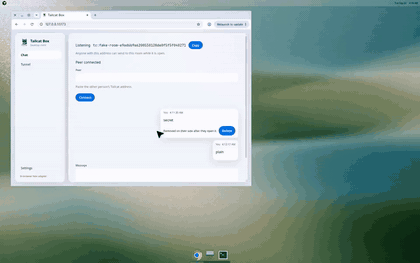
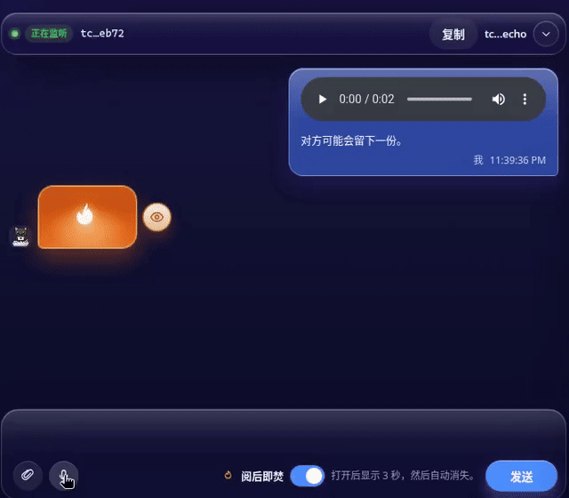
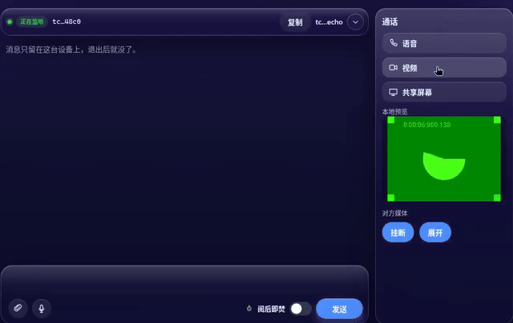
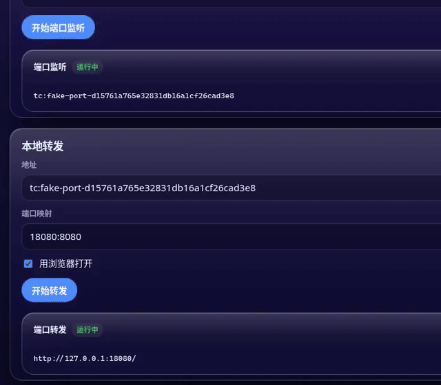

# 猫砂盆 

[English](README.md)

macOS 和 Windows 上的 [Tailscale Tailcat](https://github.com/tailscale/tailcat) 桌面客户端，用 [Wails](https://wails.io) v2 写的（Go + React + TypeScript）。

[](https://github.com/mushroom11s/tailcat-box/actions/workflows/ci.yml) [](https://github.com/mushroom11s/tailcat-box/releases) [](LICENSE) 

<p align="center">
  
</p>

## 功能演示

<table>
  <tr>
    <td align="center" valign="top" width="25%">
      <b>聊天 — 发送与阅后即焚</b><br />
      
    </td>
    <td align="center" valign="top" width="25%">
      <b>语音留言 — 按住与阅后即焚</b><br />
      
    </td>
    <td align="center" valign="top" width="25%">
      <b>实时语音 / 视频</b><br />
      
    </td>
    <td align="center" valign="top" width="25%">
      <b>穿透 — 转发并打开浏览器</b><br />
      
    </td>
  </tr>
</table>

英文名 **Tailcat Box**，中文名 **猫砂盆**。仓库：[mushroom11s/tailcat-box](https://github.com/mushroom11s/tailcat-box)。

## 功能

- **喵传** — 拖入文件（每份最多 300 MiB），可以同时开多份分享，每份有自己的二维码。另一台猫砂盆在这台电脑保持在线时，通过 Tailcat 把其中一份下载走
- **聊天** — 开一个房间，交换 Tailcat 地址，发文字、文件和语音，也能实时语音、视频和共享屏幕
- **穿透** — 把 TCP 端口挂到 Tailcat 地址上，再转到这台电脑，也可以打开对方的网页端口
- **设置** — 跟随系统 / 浅色 / 深色，中英文，密钥和 DERP，诊断，本机信息，开机启动
- **托盘** — macOS 和 Windows 上可以打开、隐藏，或跳到聊天、穿透、设置，也可以退出。左键点图标会显示窗口。macOS 应用菜单里也有这些操作。托盘图标和应用图标是同一只像素猫。关掉窗口只是藏起来，会话还在跑
- **macOS 窗口** — 窗口化时保留系统标题栏，标题是 Tailcat Box。绿色按钮，以及「视图 → 进入全屏 / 退出全屏」（⌃⌘F），走系统全屏。Windows 和 Linux 不变

前端不直接连 Tailcat，都走 Go。只有 `internal/adapter` 引入 `github.com/tailscale/tailcat`（固定 **v0.7.0**）。

## 环境

| 工具 | 说明 |
| --- | --- |
| **Go 1.27.1+** | `github.com/tailscale/tailcat` v0.7.0 需要。Wails v2.16 需要 Go 1.25+。本机 Go 更旧时，`GOTOOLCHAIN=auto` 会自己下载。 |
| **Node.js 18+** 和 npm | 前端在 `frontend/`，Vite + React + TypeScript。 |
| **Wails CLI v2** | `go install github.com/wailsapp/wails/v2/cmd/wails@v2.16.0` |
| **系统 webview** | macOS 需要 Xcode Command Line Tools。Windows 需要 WebView2，一般已经装好了。 |

```bash
wails doctor
```

## 开发

```bash
git clone https://github.com/mushroom11s/tailcat-box.git
cd tailcat-box
```

在仓库根目录：

```bash
wails dev
```

不走公网 DERP，只在本机看界面：

```bash
TAILCAT_ADAPTER=fake wails dev
```

Linux（包括只有 WebKitGTK 4.1 的 Ubuntu 24.04）：

```bash
TAILCAT_ADAPTER=fake wails dev -tags webkit2_41
```

在 `frontend/` 里单独跑 `npm run dev` 时没有 Go。界面会用网页里的模拟数据，侧栏显示「网页预览（模拟）」。

## 构建

在要出包的系统上：

```bash
wails build
```

文件在 `build/bin/tailcat-box`（macOS 是 `.app`，Windows 是 `.exe`）。平时发布的是 macOS 和 Windows。

Linux 不随版本发布。Ubuntu 24.04 装好 `libgtk-3-dev` 和 `libwebkit2gtk-4.1-dev` 之后，可以自己 `wails build -tags webkit2_41`。

只构建前端：

```bash
cd frontend
npm install
npm run build
```

## 测试

```bash
go test ./...
cd frontend && npm run build
```

拉取请求和推到 `main` 时，[CI](https://github.com/mushroom11s/tailcat-box/actions/workflows/ci.yml) 会跑同样的检查。

`go test ./...` 不含真实适配器的集成测试。那一项要能连上 Tailcat 的 DERP（HTTPS / UDP），需要时再跑：

```bash
go test -tags=integration ./internal/adapter/ -v -count=1
```

## 模拟和真实连接

默认用内置的 Tailcat 库，走公网 DERP。

| | 真实（默认） | 模拟（`TAILCAT_ADAPTER=fake`） |
| --- | --- | --- |
| 怎么开 | `wails dev` / `wails build` | `TAILCAT_ADAPTER=fake wails dev` |
| 网络 | 公网 DERP | 不联网 |
| 管道连接 | 得到 `tc…` 地址。连接时拨 TCP **1**（和直接跑 `tailcat <地址>` 一样）。 | 地址是 `tc:fake-<id>`。对方回 `echo:<内容>`。 |
| 端口 | 按映射做端口监听。本地转发和浏览听在 localhost。 | 地址是 `tc:fake-port-<id>`。 |
| 文件 | 收文件和共享目录走 TCP **22** 上的 SFTP。 | 收、发、共享、列目录都返回固定的模拟结果。 |
| SSH、SOCKS、出口节点、Exec | SSH 用 **22** 端口。SOCKS 经对方出去。出口节点和 Exec 用库里的处理。 | 固定的 `tc:fake-…` 地址，以及一个本地 SOCKS 地址。 |
| 密钥和 DERP | 解析地址走库。保存的区域和地图 URL 会用在之后的会话上。 | 解析得到占位 JSON。补全地址得到 `tc:fake-resolved`。 |
| Ping | Disco ping（先走 DERP，能直连再直连）。 | 依次打出 DERP 和直连的 EventData。 |

## 配置目录

新装的密钥和设置放在 `<用户配置目录>/tailcat-box`（密钥是 `keys/` 里的 `*.private.json`）。

| 系统 | 常见路径 |
| --- | --- |
| macOS | `~/Library/Application Support/tailcat-box` |
| Windows | `%AppData%\tailcat-box` |
| Linux | `~/.config/tailcat-box` |

如果这台电脑上已经有旧目录 `<用户配置目录>/tailcat-desktop-client`，而还没有 `tailcat-box`，密钥和设置会继续用旧目录。想换过去，把那个文件夹改名为 `tailcat-box`。也可以用 `TAILCAT_KEYS_DIR` 和 `TAILCAT_SETTINGS_DIR` 指定目录。聊天文件在 `<用户配置目录>/tailcat-box/chat`（`TAILCAT_CHAT_DIR` 可以改这个路径）。喵传的临时副本在 `<用户配置目录>/tailcat-box/miao`（`TAILCAT_MIAO_DIR`），那一份分享结束就会删掉。

设置里的密钥页还会列出 Tailcat 命令行的密钥目录（一般是 `~/.config/tailcat/keys`），方便把命令行的密钥导进来。

## 发布

推送 `v*` 标签后，GitHub Actions 会构建未签名的压缩包：macOS（Apple Silicon 和 Intel）以及 Windows（amd64 和 ARM64），并附到 GitHub Release 上。文件名类似 `tailcat-box-macos-arm64-…`、`tailcat-box-macos-amd64-…`、`tailcat-box-windows-amd64-…`、`tailcat-box-windows-arm64-…`。说明写在 `docs/releases/`。这些包没有签名，所以 Gatekeeper 和 SmartScreen 会提示。

怎么打标签、怎么先试构建，见 [docs/releases/README.md](docs/releases/README.md)。

## macOS 麦克风、摄像头和屏幕共享

第一次发语音、打视频或共享屏幕时，macOS 会弹出系统授权。`build/darwin/Info.plist`（`wails dev` 用 `Info.dev.plist`）里有 `NSMicrophoneUsageDescription`、`NSCameraUsageDescription` 和 `NSScreenCaptureUsageDescription`。Wails 会把它写进 `tailcat-box.app/Contents/Info.plist`，发布用的压缩包保留整个 `.app`，所以装好的应用可以弹出系统对话框。没有这三行说明时，系统会直接拒绝，不会询问。

未签名的包在打开前仍会碰到 Gatekeeper（系统设置 → 隐私与安全性 → 仍要打开，或右键 → 打开）。这和麦克风、摄像头、屏幕录制是两回事。应用能运行之后，第一次使用才会弹出后面那些权限。屏幕录制跟着代码签名走，所以新的未签名构建可能要再允许一次，而且经常要退出并重新打开才生效。如果之前选了不允许，就到「麦克风」「摄像头」和「屏幕与系统音频录制」里打开猫砂盆。应用里的提示中英文都会说明这一步。

`wails dev` 有时会把权限算到启动它的终端上。给那个终端授权，或者用 `wails build` 确认系统对话框。

## 目录

- `main.go` / `app.go` — Wails 入口，以及给前端调用的方法
- `internal/adapter` — Tailcat 适配器，有模拟和真实两种
- `internal/chat` — 房间、文件、语音和实时通话
- `internal/service` — 会话命令（管道连接、端口、文件、SSH、SOCKS、出口节点、Exec、Ping）
- `internal/session` — 会话状态
- `internal/store` — 命名密钥和网络设置
- `internal/tray` — 打开、隐藏、聊天、穿透、设置、会话数量、退出
- `frontend/` — 喵传、聊天、穿透和设置

`go.mod` 里的 module 路径是 `github.com/mushroom11s/tailcat-box`。

## 常见问题

同时开多个房间、多人连同一个房间、临时地址关掉后还能不能再用、本机昵称和对方备注，见 [使用常见问题](docs/faq.zh-CN.md)。

## 致谢

猫砂盆是 [Tailscale Tailcat](https://github.com/tailscale/tailcat) 的桌面客户端。

## 协议

本仓库中猫砂盆自身的代码采用 [PolyForm Noncommercial License 1.0.0](LICENSE)：允许非商用，商用需另行获得版权方授权。

嵌入的第三方（尤其是 `github.com/tailscale/tailcat` 及其他依赖）仍遵循各自原有协议。本协议只覆盖猫砂盆自身的代码，不重新授权这些依赖。
